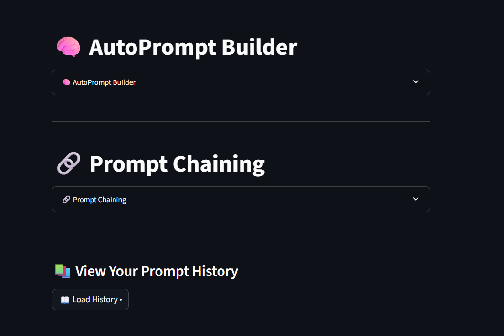
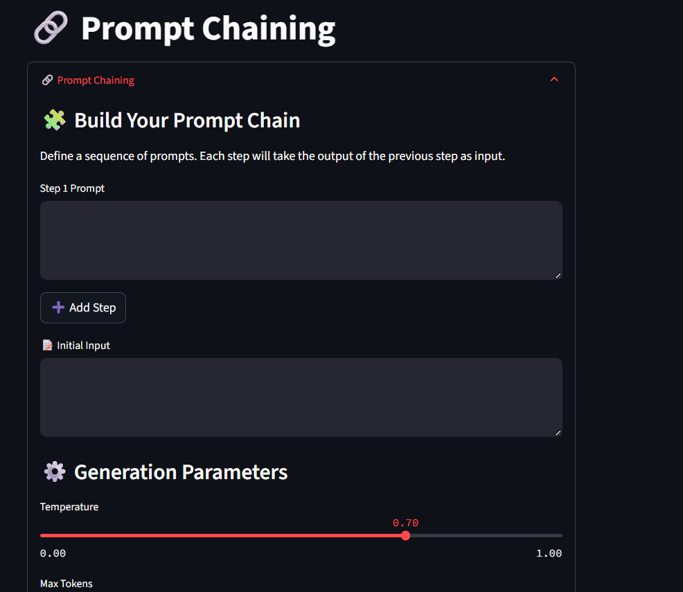
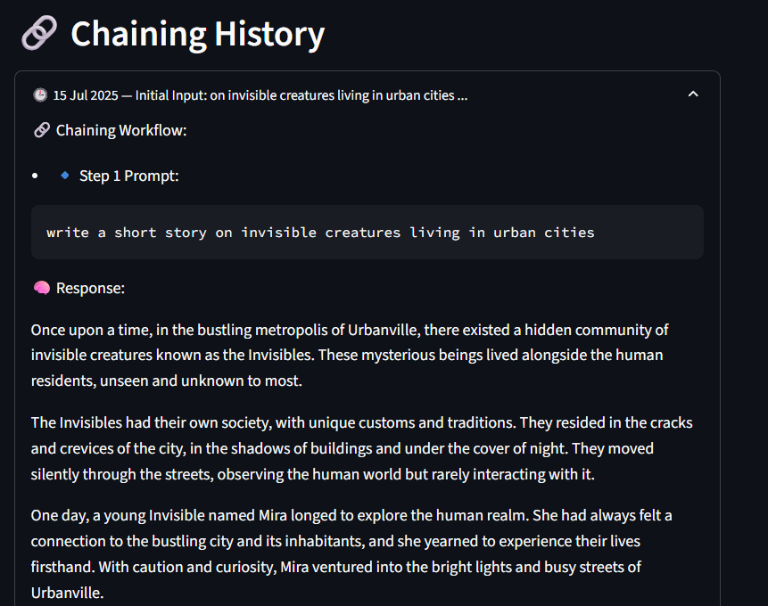
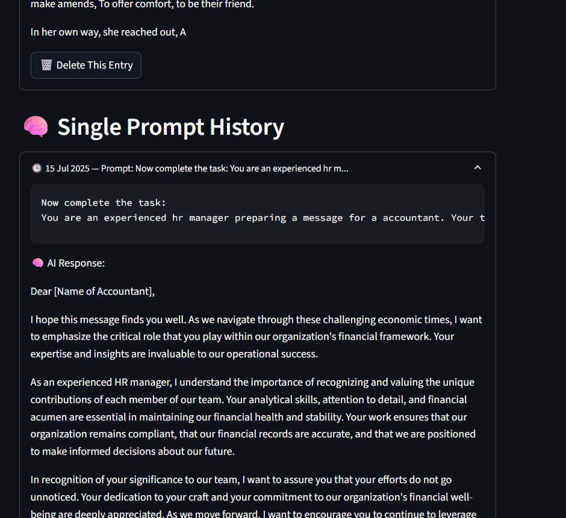
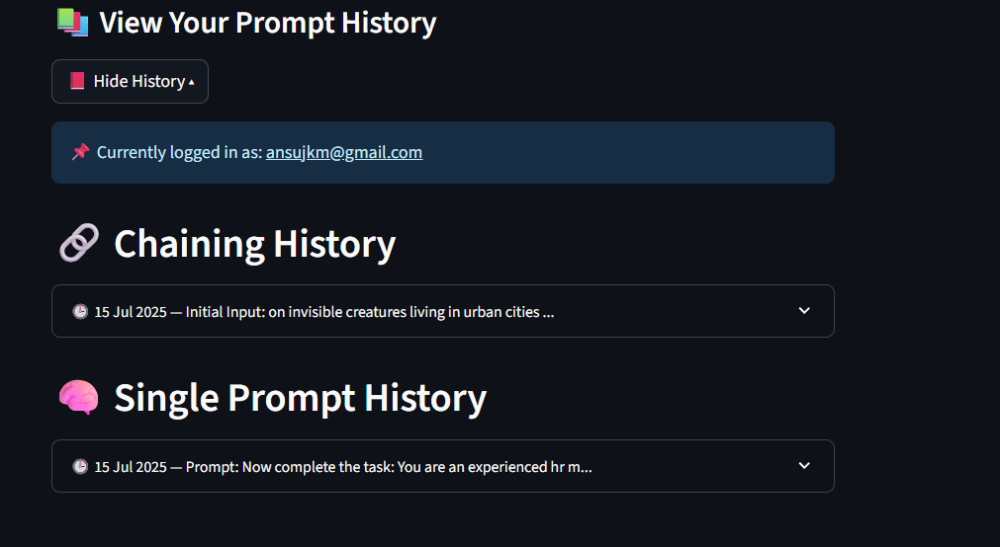
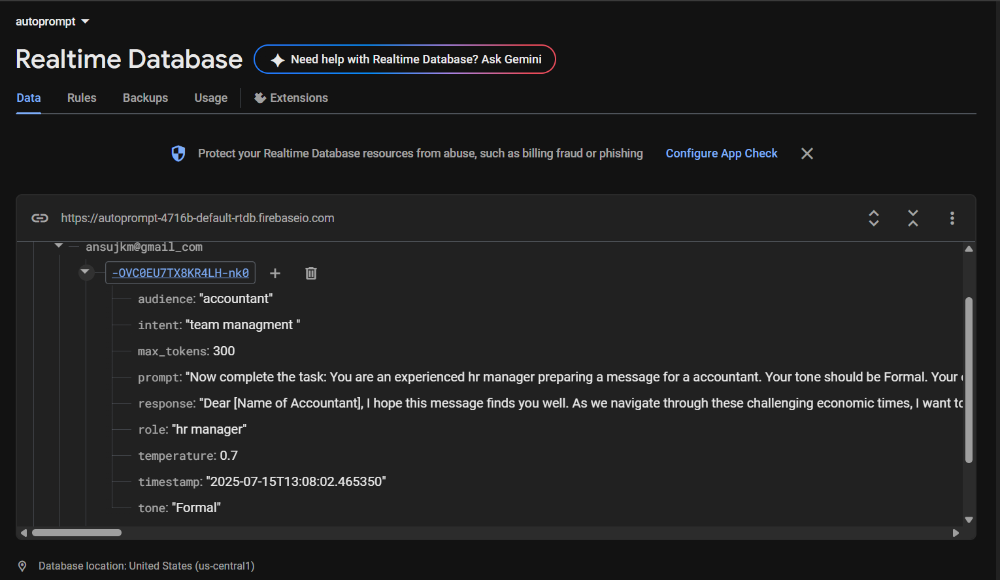

# 🧠 Auto Prompt Builder

**A Dynamic Prompt Generation & Tuning System for Industry Use**

---

## 📄 Overview

Auto Prompt Builder is an interactive, no-code platform designed to simplify and streamline prompt engineering for generative AI systems. It helps users build, test, tune, chain, and evaluate prompts without needing any programming knowledge.

Built using **Python, Streamlit, Firebase**, and **Cohere API**, the platform enables students, educators, and industry professionals to create reusable and efficient prompt workflows across multiple domains such as HR, legal, education, healthcare, finance, and research.

---

## 📝 Why Auto Prompt Builder Is Needed

As generative AI becomes more widely used in classrooms, projects, businesses, and industry workflows, the quality of the AI's output depends heavily on how well the prompt is written. However:

* Most users struggle to design effective prompts
* Prompts are often inconsistent and require repeated trial-and-error
* There is no structured system to build, tune, or reuse prompts
* Complex tasks require multi-step workflows that are hard to manage manually

**Auto Prompt Builder** solves these challenges by offering a structured, user-friendly interface where users can create, optimize, chain, and evaluate prompts without technical knowledge.

It reduces errors, standardizes prompt creation, and makes AI interactions more reliable—making it extremely useful for students, professors, and professionals who depend on AI for academic or industry projects.

---

## 🚀 Features

### 🔐 User Authentication

Secure login/signup using Firebase.

### 🧩 Prompt Templates

Industry-specific templates for HR, Legal, Education, Healthcare, and more.

### 🔗 Prompt Chaining

Create multi-step AI workflows where each output becomes the next input.

### 🧠 Few-Shot Learning

Add input/output examples to guide the AI model for more accurate results.

### ⚙️ Parameter Tuning

Adjust temperature, token length, and sampling settings with live preview.

### ⭐ Evaluation System

Rate AI responses and save feedback securely for later improvement.

### 💾 Export

Export prompt-response pairs in **TXT** or **JSON** formats.

### 🔄 Real-Time AI Responses

Instant prompt generation using the Cohere LLM.

---

## 🧱 Tech Stack

| Layer          | Technology                       |
| -------------- | -------------------------------- |
| Frontend       | Streamlit                        |
| Backend        | Python                           |
| Database       | Firebase Realtime DB |
| Authentication | Firebase Auth                    |
| AI Model       | Cohere API                       |


---

## ⚙ Installation & Setup

### **Prerequisites**

* Python 3.10+
* Cohere API key
* Firebase project with Authentication + Realtime Database
* Streamlit installed ( `pip install streamlit` )

---

### **1. Clone the Repository**

```bash
git clone https://github.com/ANSUJKMEHER/Auto-PromptBuilder.git
cd Auto-PromptBuilder
```

### **2. Install Dependencies**

```bash
pip install -r requirements.txt
```

### **3. Configure Environment Variables**

Create a `.env` file in the project root:

```
COHERE_API_KEY=your-cohere-api-key
FIREBASE_CONFIG=your-firebase-config
```

### **4. Run the Application**

```bash
streamlit run app.py
```

---

## 🧠 How the System Works

1. User logs in through Firebase Authentication
2. Selects a domain-specific template
3. Fills variables (role, intent, tone, audience)
4. (Optional) Adds few-shot examples
5. Adjusts temperature and token settings
6. Generates AI responses with preview
7. Saves, rates, or exports the result
8. Builds chaining workflows for multi-step tasks
9. Views full prompt history stored in Firebase

---
## 📸 Screenshots

### **1️⃣ Login & Main Dashboard**

**Login / Auto Page**  


**Dashboard**  

---

### **2️⃣ Template & Input Interface**
**Template Editor**  


**Input Fields**  


**Few-Shot Examples**  


---

### **3️⃣ Prompt Chaining System**
**Chaining Workflow**  


**Chaining History**  


---

### **4️⃣ Response History**
**Single Prompt History**  


**Full History**  


---

### **5️⃣ Firebase Database View**

---
## 📂 Project Structure

```
Auto-PromptBuilder/
│
├── app.py                 # Main Streamlit app
├── prompt_engine.py       # Cohere API integration
├── chaining.py            # Multi-step workflow logic
├── template_manager.py    # Template loading/saving
├── firebase_auth.py       # Login, signup, database logging
├── templates/             # Industry JSON templates
├── requirements.txt
└── README.md
```

---

## 🛠 Core Functional Modules

### **1. Template-Based Prompt Creator**

Ready-made templates for multiple industries, fully customizable.

### **2. Few-Shot Learning**

Users can provide examples to shape model behavior.

### **3. Prompt Chaining Engine**

Automates multi-step workflows like
**Extract → Summarize → Format → Analyze**.

### **4. Parameter Tuning**

Fine-control over response creativity and length.

### **5. Evaluation & History**

All prompts, responses, ratings, and chains are saved per user.

### **6. Export Tools**

Download results as `.txt` or `.json`.

---

## 🔮 Future Enhancements

* Multi-LLM support (OpenAI, Gemini, Llama 3)
* Template marketplace for sharing community prompts
* Advanced analytics dashboard
* Organization/team collaboration mode
* Conditional branching in prompt chaining
* Multilingual support

---

## 🏁 Conclusion

Auto Prompt Builder provides a complete, user-friendly workflow for creating, optimizing, and automating prompts for generative AI. Its intuitive interface, chaining engine, feedback system, and integration with Firebase and Cohere make it a highly practical tool for academic, research, and industry use.

It is specifically designed to help **students, professors, and professionals** quickly build high-quality prompts with consistency and accuracy—without needing coding expertise.

